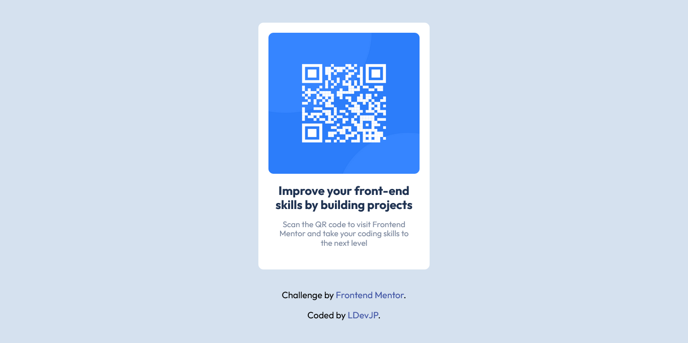

# Frontend Mentor - QR code component solution

This is a solution to the [QR code component challenge on Frontend Mentor](https://www.frontendmentor.io/challenges/qr-code-component-iux_sIO_H). Frontend Mentor challenges help you improve your coding skills by building realistic projects. 

## Table of contents

- [Overview](#overview)
  - [Screenshot](#screenshot)
  - [Links](#links)
- [My process](#my-process)
  - [Built with](#built-with)
  - [Useful resources](#useful-resources)
- [Author](#author)

**Note: Delete this note and update the table of contents based on what sections you keep.**

## Overview

### Screenshot

### Links

- Solution URL: [QR-Component](https://github.com/LDevJP/FM-QRcodecomponent)
- Live Site URL: [FR-QRComponent](https://fm-qrcodecomponentlg.netlify.app/)

## My process

### Built with

- Semantic HTML5 markup
- CSS custom properties
- Flexbox

### Useful resources

- [Box Shadow CSS Generator](https://cssgenerator.org/box-shadow-css-generator.html) - This helped me speed up the content of the box-shadow. I really liked this pattern and will use it going forward.

## Author

- Website - [Luigui PJ](https://github.com/LDevJP)
- Frontend Mentor - [@Luigui PJ](https://www.frontendmentor.io/profile/LDevJP)
